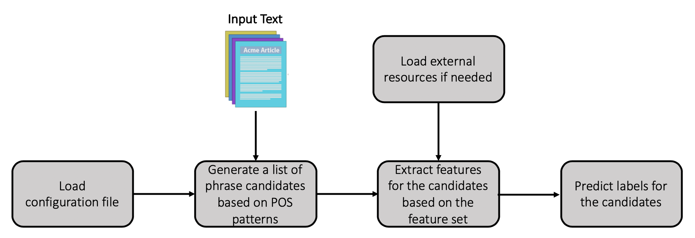

# Feature-based Keypharse Extraction

This project provides a flexible framework which can train domain-specific keyphrase extractors on label data. It provides an easy way to do feature engineering and currently supports 24 different types of features.

## Quick Links

- [Model](#model)
- [Installation](#installation)
- [Data](#data)
- [Usage](#usage)
- [Prediction](#prediction)

## Model

<p align="center"></p>

## Installation

Install spaCy and NLTK libraries for NLP, and scikit-learn library for machine learning mdoels.

## Data

The data includes two separate files: input text file and input label file.

The input text file follows the format: <doc_id>\<tab>\<text>
```
iir_1	The meaning of the term information retrieval can be very broad. Just getting a credit card out of your wallet so that you can type in the card number is a form of information retrieval. However, as an academic field of study, information retrieval might be defined thus: Information retrieval (IR) is finding material (usually documents) of an unstructured nature (usually text) that satisfies an information need from within large collections (usually stored on computers). As defined in this way, information retrieval used to be an activity that only a few people engaged in: reference librarians, paralegals, and similar professional searchers. Now the world has changed, and hundreds of millions of people engage in information retrieval every day when they use a web search engine or search their email. Information retrieval is fast becoming the dominant form of information access, overtaking traditional database-style searching (the sort that is going on when a clerk says to you: ``I'm sorry, I can only look up your order if you can give me your Order ID''). IR can also cover other kinds of data and information problems beyond that specified in the core definition above. The term ``unstructured data'' refers to data which does not have clear, semantically overt, easy-for-a-computer structure. It is the opposite of structured data, the canonical example of which is a relational database, of the sort companies usually use to maintain product inventories and personnel records. In reality, almost no data are truly ``unstructured''. This is definitely true of all text data if you count the latent linguistic structure of human languages. But even accepting that the intended notion of structure is overt structure, most text has structure, such as headings and paragraphs and footnotes, which is commonly represented in documents by explicit markup (such as the coding underlying web pages). IR is also used to facilitate ``semistructured'' search such as finding a document where the title contains Java and the body contains threading. The field of information retrieval also covers supporting users in browsing or filtering document collections or further processing a set of retrieved documents. Given a set of documents, clustering is the task of coming up with a good grouping of the documents based on their contents. It is similar to arranging books on a bookshelf according to their topic. Given a set of topics, standing information needs, or other categories (such as suitability of texts for different age groups), classification is the task of deciding which class(es), if any, each of a set of documents belongs to. It is often approached by first manually classifying some documents and then hoping to be able to classify new documents automatically. Information retrieval systems can also be distinguished by the scale at which they operate, and it is useful to distinguish three prominent scales. In web search , the system has to provide search over billions of documents stored on millions of computers. Distinctive issues are needing to gather documents for indexing, being able to build systems that work efficiently at this enormous scale, and handling particular aspects of the web, such as the exploitation of hypertext and not being fooled by site providers manipulating page content in an attempt to boost their search engine rankings, given the commercial importance of the web. We focus on all these issues in webcharlink. At the other extreme is personal information retrieval . In the last few years, consumer operating systems have integrated information retrieval (such as Apple's Mac OS X Spotlight or Windows Vista's Instant Search). Email programs usually not only provide search but also text classification: they at least provide a spam (junk mail) filter, and commonly also provide either manual or automatic means for classifying mail so that it can be placed directly into particular folders. Distinctive issues here include handling the broad range of document types on a typical personal computer, and making the search system maintenance free and sufficiently lightweight in terms of startup, processing, and disk space usage that it can run on one machine without annoying its owner. In between is the space of enterprise, institutional, and domain-specific search , where retrieval might be provided for collections such as a corporation's internal documents, a database of patents, or research articles on biochemistry. In this case, the documents will typically be stored on centralized file systems and one or a handful of dedicated machines will provide search over the collection. This book contains techniques of value over this whole spectrum, but our coverage of some aspects of parallel and distributed search in web-scale search systems is comparatively light owing to the relatively small published literature on the details of such systems. However, outside of a handful of web search companies, a software developer is most likely to encounter the personal search and enterprise scenarios. In this chapter we begin with a very simple example of an information retrieval problem, and introduce the idea of a term-document matrix (Section 1.1 ) and the central inverted index data structure (Section 1.2 ). We will then examine the Boolean retrieval model and how Boolean queries are processed.
iir_1_1	A fat book which many people own is Shakespeare's Collected Works. Suppose you wanted to determine which plays of Shakespeare contain the words Brutus AND Caesar and NOT Calpurnia. One way to do that is to start at the beginning and to read through all the text, noting for each play whether it contains Brutus and Caesar and excluding it from consideration if it contains Calpurnia. The simplest form of document retrieval is for a computer to do this sort of linear scan through documents. This process is commonly referred to as grepping through text, after the Unix command grep, which performs this process. Grepping through text can be a very effective process, especially given the speed of modern computers, and often allows useful possibilities for wildcard pattern matching through the use of . With modern computers, for simple querying of modest collections (the size of Shakespeare's Collected Works is a bit under one million words of text in total), you really need nothing more.But for many purposes, you do need more: To process large document collections quickly. The amount of online data has grown at least as quickly as the speed of computers, and we would now like tobe able to search collections that total in the order of billions to trillions of words. To allow more flexible matching operations. For example, it is impractical to perform the query Romans NEAR countrymen with grep, where NEAR might be defined as ``within 5 words'' or ``within the same sentence''. To allow ranked retrieval: in many cases you want the best answer to an information need among many documents that contain certain words. The way to avoid linearly scanning the texts for each query is to index the documents in advance. Let us stick with Shakespeare's Collected Works, and use it to introduce the basics of the Boolean retrieval model. Suppose we record for each document here a play of Shakespeare's whether it contains each word out of all the words Shakespeare used (Shakespeare used about 32,000 different words). The result is a binary term-document incidence matrix , as in Figure 1.1 . Terms are the indexed units (further discussed in Section 2.2 ); they are usually words, and for the moment you can think of them as words, but the information retrieval literature normally speaks of terms because some of them, such as perhaps I-9 or Hong Kong are not usually thought of as words. Now, depending on whether we look at the matrix rows or columns, we can have a vector for each term, which shows the documents it appears in, or a vector for each document, showing the terms that occur in it. To answer the query Brutus AND Caesar AND NOT Calpurnia, we take the vectors for Brutus, Caesar and Calpurnia, complement the last, and then do a bitwise AND. The answers for this query are thus Antony and Cleopatra and Hamlet. The Boolean retrieval model is a model for information retrieval in which we can pose any query which is in the form of a Boolean expression of terms, that is, in which terms are combined with the operators and, or, and not. The model views each document as just a set of words. Let us now consider a more realistic scenario, simultaneously using the opportunity to introduce some terminology and notation. Suppose we have N = 1{ million} documents. By documents we mean whatever units we have decided to build a retrieval system over. They might be individual memos or chapters of a book (see Section 2.1.2 for further discussion). We will refer to the group of documents over which we perform retrieval as the (document) collection . It is sometimes also referred to as a corpus (a body of texts). Suppose each document is about 1000 words long (2-3 book pages). If we assume an average of 6 bytes per word including spaces and punctuation, then this is a document collection about 6 GB in size. Typically, there might be about 500 distinct terms in these documents. There is nothing special about the numbers we have chosen, and they might vary by an order of magnitude or more, but they give us some idea of the dimensions of the kinds of problems we need to handle. We will discuss and model these size assumptions in Section 5.1. Our goal is to develop a system to address the ad hoc retrieval task. This is the most standard IR task. In it, a system aims to provide documents from within the collection that are relevant to an arbitrary user information need, communicated to the system by means of a one-off, user-initiated query. An information need is the topic about which the user desires to know more, and is differentiated from a query , which is what the user conveys to the computer in an attempt to communicate the information need. A document is relevant if it is one that the user perceives as containing information of value with respect to their personal information need. Our example above was rather artificial in that the information need was defined in terms of particular words, whereas usually a user is interested in a topic like ``pipeline leaks'' and would like to find relevant documents regardless of whether they precisely use those words or express the concept with other words such as pipeline rupture. To assess the effectiveness of an IR system (i.e., the quality of its search results), a user will usually want to know two key statistics about the system's returned results for a query. Precision : What fraction of the returned results are relevant to the information need? Recall : What fraction of the relevant documents in the collection were returned by the system? Detailed discussion of relevance and evaluation measures including precision and recall is found in Chapter 8. We now cannot build a term-document matrix in a naive way. A 500{K} 1{M} matrix has half-a-trillion 0's and 1's too many to fit in a computer's memory. But the crucial observation is that the matrix is extremely sparse, that is, it has few non-zero entries. Because each document is 1000 words long, the matrix has no more than one billion 1's, so a minimum of 99.8% of the cells are zero. A much better representation is to record only the things that do occur, that is, the 1 positions.This idea is central to the first major concept in information retrieval, the inverted index . The name is actually redundant: an index always maps back from terms to the parts of a document where they occur. Nevertheless, inverted index, or sometimes inverted file , has become the standard term in information retrieval.[*]The basic idea of an inverted index is shown in Figure 1.3 . We keep a dictionary of terms (sometimes also referred to as a vocabulary or lexicon ; in this book, we use dictionary for the data structure and vocabulary for the set of terms). Then for each term, we have a list that records which documents the term occurs in. Each item in the list which records that a term appeared in a document (and, later, often, the positions in the document) is conventionally called a posting .The list is then called a postings list (or inverted list), and all the postings lists taken together are referred to as the postings . The dictionary in Figure 1.3 has been sorted alphabetically and each postings list is sorted by document ID. We will see why this is useful in Section 1.3 , below, but later we will also consider alternatives to doing this (Section 7.1.5 ).
```

The input label file follows the format: <doc_id>\<tab>\<list_of_phrases>
```
iir-1	['information retrieval', 'documents', 'document', 'collections', 'collection', 'database-style searching', 'unstructured data', 'structured data', 'relational database', 'latent linguistic structure', 'clustering', 'web search', 'indexing', 'personal information retrieval', 'text classification', 'term-document matrix', 'boolean retrieval model', 'boolean queries', 'classification', 'information retrieval systems', 'centralized file systems', 'inverted index', 'search', 'rankings', 'terms', 'personal search']
iir-1.1	['information retrieval', 'document retrieval', 'grepping', 'grep', 'wildcard pattern matching', 'collections', 'collection', 'index', 'term-document incidence matrix', 'terms', 'term', 'query', 'querying', 'boolean retrieval model', 'documents', 'document', 'retrieval system', 'corpus', 'ad hoc retrieval', 'information need', 'relevant', 'relevance', 'precision', 'recall', 'inverted index', 'inverted file', 'dictionary', 'lexicon', 'vocabulary', 'document collections', 'document collection', 'ranked retrieval', 'incidence matrix', 'effectiveness', 'term-document matrix', 'posting', 'postings', 'postings list', 'inverted list', 'binary term-document incidence matrix', 'ir', 'relevant documents', 'ir system']
```

## Usage
Config file (```config.json```): you can set different configurations for a model you want to train; for example, different sets of features.

We provide several scripts. The usages of these scripts can be accessed by the parameter ````-h````, i.e., 
```
python get_pos_patterns.py -h
python generate_corpus_statistics.py -h
python train.py -h
python predict.py -h
```

```get_pos_patterns.py```: if you already have a pre-defined part-of-speech patterns (e.g., "NN NN" or "JJ NNS"), you do not need to run this script. It helps to generate  patterns from label data and add to your current pre-defined file if a pattern does not exist.

```
python get_pos_patterns.py --text_file data/sample/train.texts.txt --label_file data/sampe/train.labels.txt --config_file model/files/config.json --pattern_file model/files/pos_patterns.txt
```

```generate_corpus_statistics.py```: if you want to use some statistic features which require the data from an entire corpus (e.g., collection term frequency or tf-idf), you need to run this script to generate a statistics file and then provide the file path in the config file.
```
python generate_corpus_statistics.py --input_file data/corpus.txt --output_file model/files/statistics.pkl --config_file model/files/config.json --pattern_file model/files/pos_patterns.txt
```

```train.py```: is to train a keyphrase extractor using Logistic Regression model. You can evaluate the performance of the model with split data or cross validation by specifying the parameters ```--split_data``` or ```--cross_validation```.
```
python train.py --text_file data/sample/train.texts.txt --label_file data/sample/train.labels.txt --config_file model/files/config.json --pattern_file model/files/pos_patterns.txt --feature_file checkpoint/features.pkl --model_file checkpoint/logreg.model
python train.py --text_file data/sample/train.texts.txt --label_file data/sample/train.labels.txt --config_file model/files/config.json --pattern_file model/files/pos_patterns.txt --feature_file checkpoint/features.pkl --model_file checkpoint/logreg.model --split_data 0.2
python train.py --text_file data/sample/train.texts.txt --label_file data/sample/train.labels.txt --config_file model/files/config.json --pattern_file model/files/pos_patterns.txt --feature_file checkpoint/features.pkl --model_file checkpoint/logreg.model --cross_validation 5
```

## Prediction
```predict.py``` is provided to extract keyphrases from raw input text (described in [Data](#data) section). A running command example is provided below:

```
python predict.py --input_file data/sample/test.texts.txt --output_file output/output.txt --feature_file checkpoint/features.pkl --config_file model/files/config.json --pattern_file model/files/pos_patterns.txt --model_file checkpoint/logreg.model
```

The corresponding output follows the format: <doc_id>\<tab>\<list_of_keyphrases_and_their_locations>
```
iir_1_3	[('inverted index', (35, 48)), ('inverted index', (147, 160)), ('postings lists', (333, 346)), ('postings', (301, 308)), ('postings', (242, 249)), ('intersection', (353, 364)), ('merge algorithm', (630, 644)), ('postings lists', (554, 567)), ('merging postings', (546, 561))]
iir_1_4	[('free text queries', (141, 157)), ('vector space model', (79, 96)), ('ranked retrieval models', (43, 65)), ('Boolean retrieval model', (4, 26)), ('query', (343, 347)), ('documents', (316, 324)), ('term proximity operators', (1028, 1051)), ('Boolean search', (1607, 1620))]

```